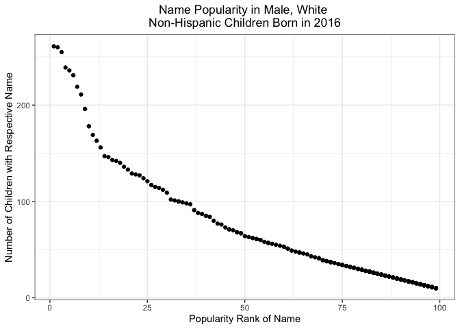

Homework 2
================
Philip Kim
10/1/2021

-   [Problem 1](#problem-1)
    -   [Read/Clean Mr. Trash Wheel
        Dataset](#readclean-mr-trash-wheel-dataset)
    -   [Clean Precipitation Data for 2018 and
        2019](#clean-precipitation-data-for-2018-and-2019)
        -   [Precipitation Data for 2018](#precipitation-data-for-2018)
        -   [Precipitation Data for 2019](#precipitation-data-for-2019)
        -   [Combining Precipitation
            Data](#combining-precipitation-data)
    -   [Data Observations Paragraph](#data-observations-paragraph)
-   [Problem 2](#problem-2)
    -   [Clean pols-month data](#clean-pols-month-data)
    -   [Clean snp data](#clean-snp-data)
    -   [Clean unemployment data](#clean-unemployment-data)
    -   [Join Datasets](#join-datasets)
    -   [Dataset Description](#dataset-description)
-   [Problem 3](#problem-3)
    -   [Tidying popularity of baby names
        dataset](#tidying-popularity-of-baby-names-dataset)
    -   [Popularity of name “Olivia”](#popularity-of-name-olivia)
    -   [Male name popularity](#male-name-popularity)
    -   [2016 White non-hispanic male children
        plot](#2016-white-non-hispanic-male-children-plot)

``` r
library(tidyverse)
library(readxl)
```

# Problem 1

## Read/Clean Mr. Trash Wheel Dataset

``` r
trashwheel_df = read_excel(
  "./data/Trash-Wheel-Collection-Totals-8-6-19.xlsx",
  sheet = 1,
  range = "A2:N406") %>% 
  janitor::clean_names() %>% 
  drop_na(dumpster) %>% 
  mutate(sports_balls = round(sports_balls, digits = 0))
```

## Clean Precipitation Data for 2018 and 2019

### Precipitation Data for 2018

``` r
precipitation_2018 = read_excel(
  "./data/Trash-Wheel-Collection-Totals-8-6-19.xlsx",
  sheet = 5,
  skip = 1) %>%
  drop_na(Month) %>% 
  mutate(year = "2018")
```

### Precipitation Data for 2019

``` r
precipitation_2019 = read_excel(
  "./data/Trash-Wheel-Collection-Totals-8-6-19.xlsx",
  sheet = 4,
  skip = 1) %>% 
  drop_na() %>% 
  mutate(year = "2019")
```

### Combining Precipitation Data

``` r
precipitation_combined = 
  bind_rows(precipitation_2018, precipitation_2019) %>% 
  janitor::clean_names() %>% 
  relocate(year) %>% 
  rename(total_in = total) %>% 
  mutate(month = month.name[month])
```

## Data Observations Paragraph

# Problem 2

## Clean pols-month data

``` r
politician_df = read_csv("./data/fivethirtyeight_datasets/pols-month.csv") %>% 
  separate(mon, c("year", "month", "day"), convert = TRUE) %>% 
  mutate(
    month = month.name[month],
    president = case_when(prez_gop == "1" ~ "gop", prez_dem == "1" ~ "dem")) %>%  
  select(-prez_gop, -prez_dem, -day)
```

## Clean snp data

``` r
snp_df = read_csv("./data/fivethirtyeight_datasets/snp.csv") %>% 
  separate(date, c("month", "day", "year"), convert = TRUE) %>% 
  mutate(
    month = factor(month.name[month], levels = month.name),
    year = if_else(year > 15, year + 1900, year + 2000)) %>% 
  arrange(year, month) %>% 
  select(year, month, close)
```

## Clean unemployment data

``` r
unemployment_df = read_csv("./data/fivethirtyeight_datasets/unemployment.csv")

unemployment_tidy_df = 
  pivot_longer(
    unemployment_df,
    Jan:Dec,
    names_to = "month",
    values_to = "unemployment_perc") %>% 
  janitor::clean_names() %>% 
  mutate(month = match(month, month.abb),
         month = month.name[month])
```

## Join Datasets

``` r
snp_pols_df = 
  left_join(politician_df, snp_df, by = c("year", "month"))

snp_pols_unemp_df =
  left_join(snp_pols_df, unemployment_tidy_df, by = c("year", "month"))
```

## Dataset Description

# Problem 3

## Tidying popularity of baby names dataset

``` r
baby_name_df = read_csv("./data/Popular_Baby_Names.csv") %>% 
  janitor::clean_names() %>% 
  mutate(
    gender = str_to_lower(gender),
    childs_first_name = str_to_lower(childs_first_name),
    ethnicity = str_to_lower(ethnicity),
    ethnicity = recode(ethnicity,
                   "asian and paci" = "asian and pacific islander",
                   "black non hisp" = "black non hispanic",
                   "white non hisp" = "white non hispanic")) %>% 
  distinct()
```

## Popularity of name “Olivia”

``` r
olivia_pop_df = baby_name_df %>% 
  filter(childs_first_name == "olivia") %>% 
  select(-gender, -childs_first_name, -count) %>% 
  pivot_wider(
    names_from = "year_of_birth",
    values_from = "rank") %>% 
  relocate(ethnicity, "2011", "2012", "2013", "2014", "2015")
```

## Male name popularity

``` r
boy_pop_df = baby_name_df %>% 
  filter(
    gender == "male",
    rank == "1") %>% 
  select(-count, -gender, -rank) %>% 
  pivot_wider(
    names_from = "year_of_birth",
    values_from = "childs_first_name") %>% 
  relocate(ethnicity, "2011", "2012", "2013", "2014", "2015")
```

## 2016 White non-hispanic male children plot

``` r
male_2016_df = baby_name_df %>% 
  filter(gender == "male",
         ethnicity == "white non hispanic",
         year_of_birth == "2016")

ggplot(male_2016_df, aes(x = rank, y = count)) + 
  labs(
    title = "Name Popularity in Male, White \nNon-Hispanic Children Born in 2016",
    x = "Popularity Rank of Name", 
    y = "Number of Children with Respective Name") + 
  theme_bw() +
  theme(plot.title = element_text(hjust = 0.5)) + 
  geom_point()
```

<!-- -->
